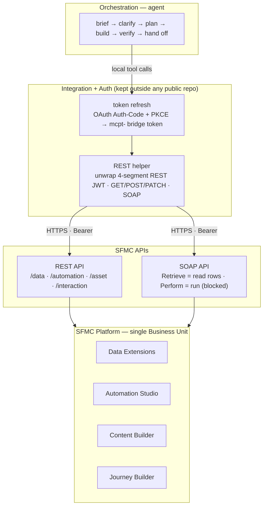
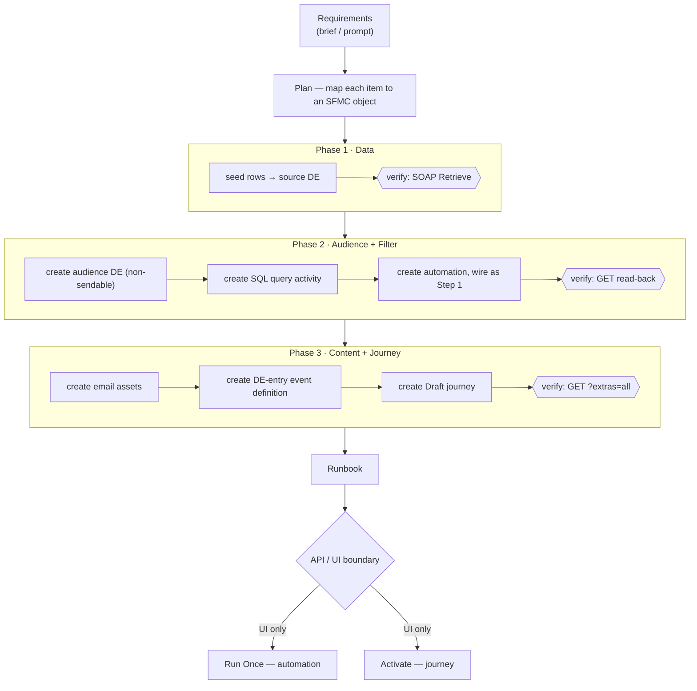
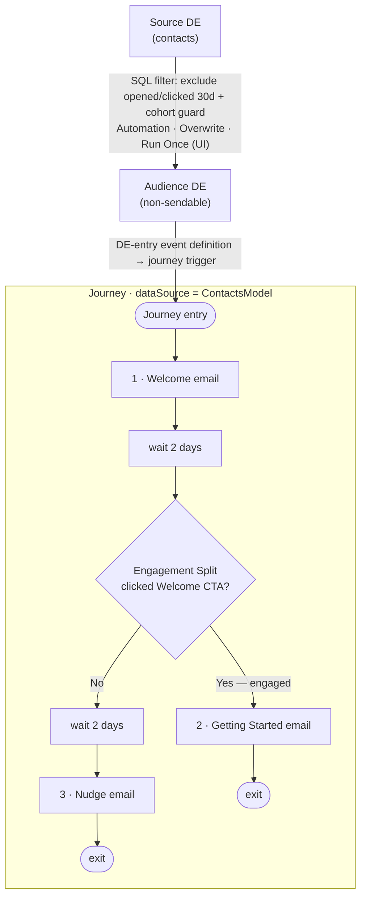

# SFMC MCP Library

**Operating Salesforce Marketing Cloud (SFMC) programmatically** through the Model Context Protocol (MCP) and the SFMC REST/SOAP APIs — a verified API knowledge base, reusable build & monitoring tooling, and a fully worked end-to-end campaign, assembled with Claude.

---

## Overview

This library captures everything needed to **build and operate SFMC entirely through APIs** — no manual UI clicking for the parts that can be automated. It exists because the SFMC API surface is full of non-obvious quirks (misleading errors, REST-vs-SOAP gaps, capability boundaries); this repo turns hard-won findings into a reusable playbook.

It contains three things:

1. **A verified API reference** — what works, what doesn't, and the exact payloads — for Data Extensions, Automation Studio, Content Builder, and Journey Builder.
2. **Reusable tooling & process** — an intake brief template, a build playbook, and a live monitoring dashboard.
3. **A worked example** — an email onboarding campaign built end-to-end via API (Data Extension → audience filter automation → emails → journey with an engagement split).

> **Note on identifiers:** All instance-specific values in this repo (tenant subdomain, enterprise ID, object IDs, endpoints) are shown as **placeholders** (`<TENANT>`, `<EID>`, `<REDACTED-ID>`). Configure your own instance before use.

---

## Capabilities at a glance

| Area | What's covered |
|------|----------------|
| **Data Extensions** | CRUD, field operations, sendable configuration (two-step create + PATCH), SOAP field mutation |
| **Automation Studio** | Build **multi-step** automations (ordered SQL Query steps, zero-based `stepNumber`) via REST; SOAP delete; run/activation is UI-only |
| **Content Builder** | HTML + AMPScript email assets with personalization; **upload + host images** (hero/logo) via the asset API → CDN URLs |
| **Journey Builder** | DE-entry events; decision / engagement / **random splits** (control holdout); timed **waits** (min/hour/day); full journey graphs (Draft) |
| **Monitoring** | Live dashboard across DEs, automations, journeys, content, and engagement data views |
| **Auth** | OAuth (Auth-Code + PKCE) refresh mechanics and the MCP-bridge-vs-REST token distinction |

---

## Agents & slash commands

The repo ships a ready-to-use Claude Code agent layer under [`.claude/`](.claude): five **task-specific subagents** (model-tiered for cost) and seven **slash commands** that delegate to them. Each agent is **least-privilege** (only its domain's MCE MCP tools) and **blends two execution paths** — it prefers the MCE MCP tools when that server is loaded, and falls back to direct REST/SOAP otherwise.

| Subagent | Model | Scope | Slash command(s) |
|---|---|---|---|
| `data-agent` | Haiku | Data Extension schema + row CRUD | `/de-crud` |
| `automation-agent` | Sonnet | Automation Studio + SQL Query Activities | `/sql-query`, `/automation-design` |
| `journey-agent` | Sonnet | Journey Builder (splits, waits, contacts in/out) | `/journey-design` |
| `content-agent` | Sonnet | Content Builder + email / SMS / push + sends | `/content-create`, `/send-message` |
| `admin-agent` | Haiku | Read-only audit, subscriber & org-config lookups | `/admin-audit` |

**Built-in guardrails:** destructive ops require a dry-run preview + explicit confirmation; async ops report a job ID and poll ≤ 3×; live sends (email/SMS/push) require confirmation; tool lists are least-privilege; tokens are never echoed. Full routing + rules live in [`CLAUDE.md`](CLAUDE.md); definitions in [`.claude/agents/`](.claude/agents) and [`.claude/skills/`](.claude/skills).

> Agents and commands load on Claude Code session start. MCP tools activate when the `sfmc` server is connected; otherwise the agents use the direct REST/SOAP path (`sfmc.py`).

---

## Architecture

The build is layered: an orchestration agent drives an auth/integration layer, which brokers tokens and HTTP to the SFMC REST/SOAP APIs, which front the platform objects.

### Build sequence

Each object is created, then **read back and verified**, before moving on. The final two steps cross a hard platform boundary: the API can *build* but not *run/activate*.

### Runtime data flow (worked example)

📐 Full diagrams + design rationale: [`ARCHITECTURE.md`](Outputs/ARCHITECTURE.md)

---

## Repository map

Organized into knowledge folders:

| Path | What it is |
|------|------------|
| **`Automation Memory/`** | |
| &nbsp;&nbsp;[`AUTOMATION-API-CAPABILITIES.md`](Automation%20Memory/AUTOMATION-API-CAPABILITIES.md) | Verified Automation Studio API reference — what works / what's UI-only |
| **`Journey Memory/`** | |
| &nbsp;&nbsp;[`JOURNEY-CONFIGURATION-SPEC.md`](Journey%20Memory/JOURNEY-CONFIGURATION-SPEC.md) | Journey configuration specification |
| &nbsp;&nbsp;[`JOURNEY-CREATION-FINDINGS.md`](Journey%20Memory/JOURNEY-CREATION-FINDINGS.md) | Journey creation findings (REST vs SOAP) |
| **`Campaign Designing/`** | |
| &nbsp;&nbsp;[`CAMPAIGN-DESIGN-NOTES.md`](Campaign%20Designing/CAMPAIGN-DESIGN-NOTES.md) | Campaign design rationale + API lessons learned |
| &nbsp;&nbsp;[`MCP-Onboarding-Campaign-Runbook.md`](Campaign%20Designing/MCP-Onboarding-Campaign-Runbook.md) | The worked campaign: built objects + UI run/activate steps |
| **`Outputs/`** | |
| &nbsp;&nbsp;[`ARCHITECTURE.md`](Outputs/ARCHITECTURE.md) | Architecture diagrams (Mermaid) + key design decisions |
| &nbsp;&nbsp;[`MCP_TEST_CASES.md`](Outputs/MCP_TEST_CASES.md) | Test-case & use-case library for validating the integration |
| &nbsp;&nbsp;[`SFMC-MCE-to-MCN-Migration-Research.md`](Outputs/SFMC-MCE-to-MCN-Migration-Research.md) | MCE → Marketing Cloud Next migration research (adversarially verified) |
| &nbsp;&nbsp;[`MCE-MCP-Tool-Catalog.md`](Outputs/MCE-MCP-Tool-Catalog.md) | Official MCE MCP server tool catalog — ~100 tools across 9 categories |
| &nbsp;&nbsp;[`SFMC-MCP-SESSION-NOTES.md`](Outputs/SFMC-MCP-SESSION-NOTES.md) | Working session notes |
| &nbsp;&nbsp;`Salesforce MCP + Claude Code Integration Guide.docx` | Setup & integration guide |
| **`Inputs/`** | |
| &nbsp;&nbsp;[`SFMC-Campaign-Brief-Template.xlsx`](Inputs/SFMC-Campaign-Brief-Template.xlsx) | Reusable intake brief that maps 1:1 to SFMC objects |
| **`Content Memory/` · `Data Extension Memory/`** | Reserved for future content / DE references |
| **`.claude/agents/` · `.claude/skills/`** | 5 task-specific subagents + 7 slash commands (see [Agents & slash commands](#agents--slash-commands)) |

---

## Quickstart

1. **Connect.** Refresh the OAuth token (Auth-Code + PKCE). The MCP refresh yields an `mcpt-` *bridge* token valid for MCP tools; the **REST-usable platform JWT is the 4-segment token embedded inside it**. Token TTL ≈ 18 min — refresh immediately before a build and batch writes.
2. **Build.** Work in phases (Data → Audience + Filter → Content + Journey), reading back and verifying after every write. Mirror an existing live object's JSON rather than guessing. See [`CAMPAIGN-DESIGN-NOTES.md`](Campaign%20Designing/CAMPAIGN-DESIGN-NOTES.md) and [`AUTOMATION-API-CAPABILITIES.md`](Automation%20Memory/AUTOMATION-API-CAPABILITIES.md).
3. **Hand off.** The API builds everything to "ready"; **running an automation (Run Once) and activating a journey are UI-only** — deliver a short runbook for those two clicks.
4. **Monitor.** Pull a live dashboard across DEs, automations, journeys, content, and 30-day engagement (Sent/Open/Click).

---

## Key lessons (the short version)

- **API can build, but not run/activate** — automation Run Once and journey publish are UI-only (the start endpoints reject; SOAP `Perform` returns `InvalidRequest`).
- **Multi-step automations DO build via API** — the *write* field is `stepNumber` and must be **zero-based**; the *read-back* field is `step` (1-based). Sending `step` (or 1-based) → opaque **500** on PATCH / clear **400** on POST. (The earlier "single-step only" note was a client-side bug.)
- **Control via journey Random Split** — `RANDOMSPLIT` outcomes carry `arguments.percentage` (must sum to 100); the control branch omits `next` to hold contacts out. `WAIT` supports `MINUTES/HOURS/DAYS/WEEKS`.
- **Target non-sendable DEs for SQL** — a sendable target throws *"could not build exclusion text."*
- **Journeys need `metaData.dataSource = "ContactsModel"`** for decision/engagement-split fields to resolve.
- **Read rows via SOAP `Retrieve`, parse per `<Property>`** — the REST DE rowset GET returns 404; SFMC omits `<Value>` for null fields, so a flat name/value regex silently drops values on multi-field reads.
- **SOAP returns HTTP 200 even on failure** — always parse `<OverallStatus>`, trust the read-back not the status code.
- **Token expiry differs by API** — REST → **401**, SOAP → **HTTP 500**; tokens last ~18 min, so batch live calls inside the window.
- **Delete automations via SOAP** (`Delete` ObjectType `Automation`) — REST `DELETE` 404s.
- **Host email images via the asset API** — upload PNG/JPG (base64) → published CDN URL; reference that, not an external placeholder.
- **Watch the misleading errors** — e.g. `length` vs `maxLength`, `EmailAddress` requiring explicit `length`.

Full detail (updated 2026-06-11) in [`AUTOMATION-API-CAPABILITIES.md`](Automation%20Memory/AUTOMATION-API-CAPABILITIES.md) and [`CAMPAIGN-DESIGN-NOTES.md`](Campaign%20Designing/CAMPAIGN-DESIGN-NOTES.md).

---

## Test cases

A structured validation suite (DE CRUD, field ops, sendable config, folder navigation, automation/journey querying, error handling, SOAP-vs-REST, performance) lives in [`MCP_TEST_CASES.md`](Outputs/MCP_TEST_CASES.md).

---

*Maintained as an Accenture Canada AI Accelerators knowledge asset. Identifiers are redacted — bring your own SFMC instance configuration.*

Claude Code $$$$
- Approx $8 USD on Enterprise License 
- Opus 4.8 base input rate is $5/MTok, so:
1.Cache read: 33.6M tokens × $0.50/MTok = ~$16.80
2.Cache write: 2.2M tokens × $6.25/MTok = ~$13.75
- Haiku 4.5 base input rate is $1/MTok, so:
1.Cache read: 10.8M tokens × $0.10/MTok = ~$1.08
  

 

 

 

